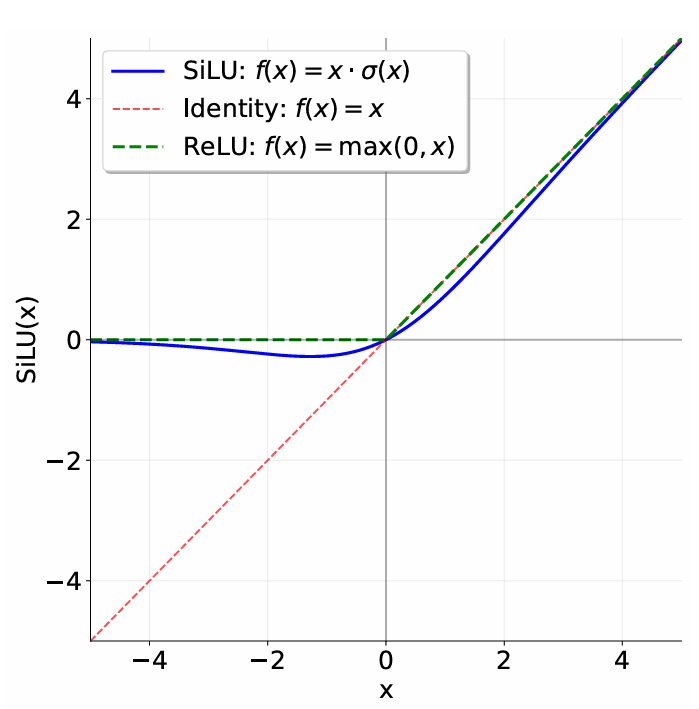

## 3.5 Pre-Norm Transformer Block

Each Transformer block has two sub-layers: a multi-head self-attention mechanism and a position-wise feed-forward network (Vaswani et al., 2017, section 3.1).

In the original Transformer paper, the model uses a residual connection around each of the two sub-layers, followed by layer normalization. This architecture is commonly known as the “post-norm” Transformer, since layer normalization is applied to the sublayer output. However, a variety of work has found that moving layer normalization from the output of each sub-layer to the input of each sub-layer (with an additional layer normalization after the final Transformer block) improves Transformer training stability [Nguyen and Salazar, 2019, Xiong et al., 2020]—see Figure 2 for a visual representation of this “pre-norm” Transformer block. The output of each Transformer block sub-layer is then added to the sub-layer input via the residual connection (Vaswani et al., 2017, section 5.4). An intuition for pre-norm is that there is a clean “residual stream” without any normalization going from the input embeddings to the final output of the Transformer, which is purported to improve gradient flow. This pre-norm Transformer is now the standard used in language models today (e.g., GPT-3, LLaMA, PaLM, etc.), so we will implement this variant. We will walk through each of the components of a pre-norm Transformer block, implementing them in sequence.

### 3.5.1 Root Mean Square Layer Normalization

The original Transformer implementation of Vaswani et al. [2017] uses layer normalization [Ba et al., 2016] to normalize activations. Following Touvron et al. [2023], we will use root mean square layer normalization (RMSNorm; Zhang and Sennrich, 2019, equation 4) for layer normalization. Given a vector $\mathbf{a} \in \mathbb{R}^{d_{\text{model}}}$ of activations, RMSNorm will rescale each activation $a_i$ as follows:

$$
\text{RMSNorm}(a_i) = \frac{a_i}{\text{RMS}(\mathbf{a})} g_i, \quad \text{where} \quad \text{RMS}(\mathbf{a}) = \sqrt{\frac{1}{d_{\text{model}}} \sum_{i=1}^{d_{\text{model}}} a_i^2 + \epsilon} \quad (4)
$$

Here, $g_i$ is a learnable “gain” parameter (there are $d_{\text{model}}$ such parameters total), and $\epsilon$ is a hyperparameter that is often fixed at `1e-5`.

You should upcast your input to `torch.float32` to prevent overflow when you square the input. Overall, your `forward` method should look like:

```python
in_dtype = x.dtype
x = x.to(torch.float32)
# Your code here performing RMSNorm
...
result = ...
# Return the result in the original dtype
return result.to(in_dtype)
```

**Problem (rmsnorm): Root Mean Square Layer Normalization (1 point)**

**Deliverable:** Implement `RMSNorm` as a `torch.nn.Module`. We recommend the following interface:

```python
def __init__(self, d_model: int, eps: float = 1e-5, device=None, dtype=None)
```

Construct the `RMSNorm` module. This function should accept the following parameters:

-   `d_model: int` Hidden dimension of the model
-   `eps: float = 1e-5` Epsilon value for numerical stability
-   `device: torch.device | None = None` Device to store the parameters on
-   `dtype: torch.dtype | None = None` Data type of the parameters

```python
def forward(self, x: torch.Tensor) -> torch.Tensor
```

Process an input tensor of shape `(batch_size, sequence_length, d_model)` and return a tensor of the same shape.

**Note:** Remember to upcast your input to `torch.float32` before performing the normalization (and later downcast to the original dtype), as described above.

To test your implementation, implement the test adapter at `[adapters.run_rmsnorm]`. Then, run `uv run pytest -k test_rmsnorm`.

### 3.5.2 Position-Wise Feed-Forward Network
<div style="text-align: center;">
    
    <p><em>Figure 3: Comparing the SiLU (aka Swish) and ReLU activation functions.</em></p>
</div>

In the original Transformer paper (section 3.3 of Vaswani et al. [2017]), the Transformer feed-forward network consists of two linear transformations with a ReLU activation (ReLU(x) = max(0,x)) between them. The dimensionality of the inner feed-forward layer is typically 4x the input dimensionality.

However, modern language models tend to incorporate two main changes compared to this original design: they use another activation function and employ a gating mechanism. Specifically, we will implement the “SwiGLU” activation function adopted in LLMs like Llama 3 [Grattafiori et al., 2024] and Qwen 2.5 [Yang et al., 2024], which combines the SiLU (often called Swish) activation with a gating mechanism called a Gated Linear Unit (GLU). We will also omit the bias terms sometimes used in linear layers, following most modern LLMs since PaLM [Chowdhery et al., 2022] and LLaMA [Touvron et al., 2023].

The SiLU or Swish activation function [Hendrycks and Gimpel, 2016, Elfwing et al., 2017] is defined as follows:

$$
\text{SiLU}(x) = x \cdot \sigma(x) = \frac{x}{1 + e^{-x}} \quad (5)
$$

As can be seen in Figure 3, the SiLU activation function is similar to the ReLU activation function, but is smooth at zero.

Gated Linear Units (GLUs) were originally defined by Dauphin et al. [2017] as the element-wise product of a linear transformation passed through a sigmoid function and another linear transformation:

$$
\text{GLU}(x, W_1, W_2) = \sigma(W_1 x) \odot W_2 x, \quad (6)
$$

where $\odot$ represents element-wise multiplication. Gated Linear Units are suggested to “reduce the vanishing gradient problem for deep architectures by providing a linear path for the gradients while retaining non-linear capabilities.”

Putting the SiLU/Swish and GLU together, we get the SwiGLU, which we will use for our feed-forward networks:

$$
\text{FFN}(x) = \text{SwiGLU}(x, W_1, W_2, W_3) = W_2(\text{SiLU}(W_1 x) \odot W_3 x), \quad (7)
$$

where $x \in \mathbb{R}^{d_{\text{model}}}$, $W_1, W_3 \in \mathbb{R}^{d_{\text{ff}} \times d_{\text{model}}}$, $W_2 \in \mathbb{R}^{d_{\text{model}} \times d_{\text{ff}}}$, and canonically, $d_{\text{ff}} = \frac{8}{3}d_{\text{model}}$.

Shazeer [2020] first proposed combining the SiLU/Swish activation with GLUs and conducted experiments showing that SwiGLU outperforms baselines like ReLU and SiLU (without gating) on language modeling tasks. Later in the assignment, you will compare SwiGLU and SiLU. Though we’ve mentioned some heuristic arguments for these components (and the papers provide more supporting evidence), it’s good to keep an empirical perspective: a now famous quote from Shazeer’s paper is

> We offer no explanation as to why these architectures seem to work; we attribute their success, as all else, to divine benevolence.

**Problem (positionwise_feedforward): Implement the position-wise feed-forward network (2 points)**

**Deliverable:** Implement the `SwiGLU` feed-forward network, composed of a `SiLU` activation function and a `GLU`.

**Note:** In this particular case, you should feel free to use `torch.sigmoid` in your implementation for numerical stability.

You should set $d_{\text{ff}}$ to approximately $\frac{8}{3} \times d_{\text{model}}$ in your implementation, while ensuring that the dimensionality of the inner feed-forward layer is a multiple of 64 to make good use of your hardware. To test your implementation against our provided tests, you will need to implement the test adapter at `[adapters.run_swiglu]`. Then, run `uv run pytest -k test_swiglu` to test your implementation.
